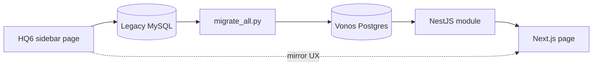

# HQ6 → Vonos — Infrastructure-First Migration Plan

**Audience:** Engineers mirroring Ultimate POS legacy installs into Vonos.

> **Scope:** **HQ6** (`hq6.vonosautomarket.com`) is the **Vonos Automotive (VA)**
> reference for job-centric + Essentials HRM flows. **Retail tenants** (VISP, VSP,
> VW, VC) each have their own legacy site, SQL dump, and audit doc — use §6 below
> for retail; use §5 for VA-only automotive.

Legacy reference: `hq6.vonosautomarket.com/` (gitignored, VA), `visp.vonosautomarket.com`, `vsp.vonosautomarket.com`, `audit.vonosautos.com`, cafe install.

---

## How to work each page (repeatable process)

For **every** HQ6 sidebar link:

1. **Shell route** — Laravel `GET` page (Blade).
2. **Data endpoints** — AJAX/DataTable URLs (see `public/js/*.js`, controller `@ajax` methods).
3. **MySQL tables** — which tables are read/written (from audits + `transactions.type`).
4. **Vonos atom** — Prisma model(s) + NestJS module.
5. **ETL** — does `scripts/migrate_all.py` already import this data for VISP/VSP/VW?
6. **API** — does `GET/POST` exist and return the same *business* shape?
7. **UI** — only after 4–6 are green: wire `lib/api/*` → page component.

---

## Status legend

| Symbol | Meaning |
|--------|---------|
| **ETL ✓** | Dry-run / write path exists; data in Postgres for tenant |
| **ETL ○** | Partial or quantity-only (e.g. opening stock → `Item.quantity`, not movements) |
| **ETL ✗** | Explicitly out of v1 scope |
| **API ✓** | NestJS endpoints live |
| **API ○** | Partial (list only, no create, or ledger-only) |
| **API ✗** | Not built |
| **UI ✓** | Real view wired to API |
| **UI ○** | Stub / placeholder |
| **UI ✗** | Route missing |

---

## Sidebar → infrastructure matrix

Applies to **VISP & VSP** (transaction retail) unless noted. **VW** differences in §4.

### 1. Home

| Sidebar | HQ6 endpoints | Legacy tables | Vonos models | Vonos API | ETL VISP/VSP | ETL VW | UI |
|---------|---------------|---------------|--------------|-----------|--------------|--------|-----|
| Overview | `/home`, `/home/get-totals` | `transactions`, `variation_location_details` | aggregates | `GET /overview/dashboard` | ○ derived | ○ derived | ✓ |
| Stock alert panel | `/home/product-stock-alert` | `products`, `variations`, `vld` | `Item` | `GET /overview/panels/stock-alert` | ✓ items | ✓ items | ✓ |
| Purchase payment dues | `/home/purchase-payment-dues` | `transactions` purchase, `transaction_payments` | `StockMovement`, `Payment` | `GET /overview/panels/purchase-payment-dues` | ○ | ✗ no purchases | ✓ |
| Sales payment dues | `/home/sales-payment-dues` | `transactions` sell, payments | `Sale`, `Payment` | `GET /overview/panels/sales-payment-dues` | ✓ | ○ outbound only | ✓ |

### 2. User Management

| Sidebar | HQ6 | Legacy | Vonos | API | ETL | UI |
|---------|-----|--------|-------|-----|-----|-----|
| Users | `/users` | `users`, `roles` | `User` | `GET /users` | ✗ re-invite | ✓ HrView |
| Roles | `/roles` | `roles`, `permissions` | — | — | ✗ | ○ stub |
| Commission agents | `/sales-commission-agents` | `users` + commission fields | — | — | ✗ | ○ stub |

### 3. Contacts

| Sidebar | HQ6 | Legacy | Vonos | API | ETL VISP/VSP | UI |
|---------|-----|--------|-------|-----|--------------|-----|
| Suppliers | `/contacts?type=supplier` | `contacts` | `Supplier` | `GET/POST /suppliers` | ✓ | ✓ |
| Customers | `/contacts?type=customer` | `contacts` | `Customer` | `GET/POST /customers` | ✓ | ✓ |
| Customer groups | `/customer-group` | `customer_groups` | `CustomerGroup` | `GET/POST /customer-groups` | ○ 2 rows | ✓ |
| Import contacts | import UI | CSV | — | — | ✗ | ○ stub |
| Row: Pay / Ledger | `/get-contact-due`, `/contacts/ledger` | `transaction_payments`, `account_transactions` | `Payment`, `LedgerEntry` | ○ partial | ○ payments imported | ○ actions stub |

### 4. Products

| Sidebar | HQ6 | Legacy | Vonos | API | ETL | UI |
|---------|-----|--------|-------|-----|-----|-----|
| List products | `/products` | `products`, `variations`, `vld` | `Item`, `ItemLocationStock` | `GET /items` | ✓ | ✓ catalog/inventory |
| Add product | `/products/create` | above | `Item` | `POST /items` | — live | ✓ |
| Update price | bulk price UI | `variations` | `Item` | `PATCH /items/:id` | — | ○ |
| Print labels | `/labels/show` | products | — | ✗ | ✗ | ○ stub |
| Variations | variation templates | `product_variations` | — | ✗ | ✗ | ○ stub |
| Import products | import | CSV | — | ✗ | ✗ | ○ stub |
| Import opening stock | opening stock import | `transactions` opening_stock | `Item.quantity` | backfill script | ✓ qty seed | ○ stub |
| Price groups | `/selling-price-group` | `selling_price_groups` | `SellingPriceGroup` | `GET /catalog-meta/...` | ○ empty | ○ |
| Units / Categories / Brands / Warranties | meta CRUD | `units`, `categories`, `brands`, `warranties` | `ProductUnit`, etc. | `GET /catalog-meta/*` | ○ partial | ○ meta lists |

### 5. Purchases

| Sidebar | HQ6 | Legacy | Vonos | API | ETL VISP/VSP | ETL VW | UI |
|---------|-----|--------|-------|-----|--------------|--------|-----|
| Purchase orders | `/purchase-order` | `transactions` + PO flags | `StockMovement` | `GET /stock-movements` | ○ | ✗ | ○ |
| List purchases | `/purchases` | `transactions` type=purchase | `StockMovement` inbound | `GET /stock-movements?type=inbound` | ○ lines exist, not as movements | ✗ zero purchases | ✓ |
| Add purchase | `/purchases/create` | purchase + `purchase_lines` | `StockMovement` | `POST /stock-movements` | — live | — live | ✓ |
| Purchase return | `/purchase-return` | purchase_return | `StockMovement` | partial filter | ✗ | ✗ | ○ |
| Outbound | — | sell (VW) | `StockMovement` outbound | `GET /stock-movements?type=outbound` | N/A | ✓ 284 | ✓ VW only |
| Transfers | transfer UI | `transfer_parent_id` | `StockMovement` transfer | `GET /transfers` | N/A | ✗ | ✓ VW only |

**Sync priority:** Add ETL path `transactions.type=purchase` → `StockMovement(inbound)` for VISP/VSP (2,460 / 1,302 `purchase_lines` in dumps).

### 6. Sell (VISP/VSP only)

| Sidebar | HQ6 | Legacy | Vonos | API | ETL | UI |
|---------|-----|--------|-------|-----|-----|-----|
| All sales | `/sells` | `transactions` sell | `Sale` + lines | `GET /sales` | ✓ | ✓ |
| Add sale | `/sells/create` | sell + lines + payments | `Sale` | `POST /sales` | — live | ✓ |
| POS / List POS | POS screen | sell + `cash_registers` | `Sale` | `POST /sales` | ○ registers not migrated | ○ stub |
| Drafts / Quotations | sub_status filters | `transactions` | `Sale` status | `GET /sales?status=` | ○ if in dump | ○ stub |
| Sell return | `/sell-return` | sell_return | — | — | ✗ no rows | ○ |
| Shipments | shipping_status | `transactions` | `Sale` fields | partial | ○ | ○ stub |
| Discounts | `/discounts` | `discounts` | — | ✗ | ✗ | ○ stub |
| Import sales | import | CSV | — | ✗ | ✗ | ○ stub |

### 7. Expenses

| Sidebar | HQ6 | Legacy | Vonos | API | ETL VISP/VSP | UI |
|---------|-----|--------|-------|-----|--------------|-----|
| List expenses | `/expenses` | `transactions` expense | `Expense` **or** `LedgerEntry` | `GET /expenses` | ✗ txn type not in VISP v1 map | ✓ |
| Add expense | `/expenses/create` | expense txn | `Expense` | `POST /expenses` | — live | ✓ |
| Expense categories | `/expense-categories` | `expense_categories` | `ExpenseCategory` | `GET/POST/PATCH/DELETE /expenses/categories` | ○ 36 cats in dump, not in Expense table | ✓ |

**Sync priority:** ETL `expense_categories` → `ExpenseCategory`; `transactions.type=expense` → `Expense` or `LedgerEntry`.

### 8. Payment Accounts

| Sidebar | HQ6 | Legacy | Vonos | API | ETL VISP/VSP | ETL VW | UI |
|---------|-----|--------|-------|-----|--------------|--------|-----|
| List accounts | `/account` | `accounts` | `PaymentAccount` | `GET /payment-accounts` | ✓ 31 | ✗ 0 | ✓ |
| Balance / Trial / Cash flow | report routes | `account_transactions` | derived | report runners | ✓ partial | ✗ | ✓ reports |
| Payments | payment UI | `transaction_payments` | `Payment` | `GET /payments` | ✓ | ○ | ✓ |

### 9. Reports (17 items)

All shell: `GET /reports/{slug}`. Data: `GET /reports/*` ajax.  
Vonos: single runner `GET /reports/run?reportId=` → `reportRunner.ts`.

| Report | Legacy source | Vonos handler | ETL needed | UI |
|--------|---------------|---------------|------------|-----|
| Profit / Loss | ledger + sells | `buildProfitLossReport` | ✓ ledger | ✓ |
| Purchase & Sale | purchases + sells | `buildPurchaseSaleReport` | ○ purchases | ✓ |
| Tax | sell tax fields | `buildTaxReport` | ✓ | ✓ |
| Supplier & Customer | contacts + dues | `buildContactsSummaryReport` | ✓ | ✓ |
| Customer groups | `customer_groups` | `buildCustomerGroupsReport` | ○ | ✓ |
| Stock | `vld` | stock aggregators | ✓ | ✓ |
| Trending / Items / Product purchase/sell | sell/purchase lines | product aggregators | ✓ sells | ✓ |
| Purchase/Sell payment | `transaction_payments` | payment reports | ✓ | ✓ |
| Expense / Register / Sales rep / Activity | various | finance/audit aggregators | ○ | ✓ |

Reports are **read models** — fix upstream ETL (purchases, expenses) and reports auto-improve.

### 10. HRM

| Sidebar | HQ6 | Legacy | Vonos | API | ETL VISP | ETL VSP | UI |
|---------|-----|--------|-------|-----|----------|---------|-----|
| Payroll | `/hrm/payroll` | `essentials_payroll_*`, payroll txns | `Payroll` | `GET/POST /hrm/payroll` | ✗ 588 txns | ✗ empty | ✓ |
| Payroll groups | datatable ajax | `essentials_payroll_groups` | `PayrollGroup` | `GET/POST /hrm/payroll-groups` | ✗ 31 groups | ✗ | ✓ tab |
| Pay components | `/essentials/allowance-deduction` | `essentials_allowances_and_deductions` | `PayComponent` | `GET/POST /hrm/pay-components` | ✗ | ✗ | ✓ tab |
| Leave / Attendance / etc. | Essentials routes | `essentials_*` | — | ✗ | ✗ | ✗ | ✗ |

**Sync priority (VISP only):** ETL essentials payroll → `Payroll` + `LedgerEntry` expense.

### 11. Settings

| Sidebar | HQ6 | Legacy | Vonos | API | UI |
|---------|-----|--------|-------|-----|-----|
| Business settings | `/business/settings` | `business` | `Tenant.config` JSON | `PATCH /tenants/config` | ✓ |
| Locations | `/business-location` | `business_locations` | `Tenant.config.businessLocations` | tenant config | ✓ |
| Invoice / Barcode / Printers / Tax | various | `invoice_*`, `barcodes`, `tax_rates` | partial in config | — | ○ stubs |

---

## Per-tenant: what legacy actually has (data truth)

Use this to decide **what ETL must run** before UI can show real numbers.

### VISP (`vonomglk_vsp` → `tenant_visp_001`)

| Domain | Legacy volume | In Postgres today (dry-run) | Gap |
|--------|---------------|----------------------------|-----|
| Items | ~2,543 | ~2,551 | OK |
| Customers | ~4,814 | ~4,701 | OK |
| Sales | ~3,043 | ~3,082 | OK |
| Purchase lines | ~2,334 | **not as inbound movements** | **ETL gap** |
| Payments / accounts | ~3k | ✓ | OK |
| Payroll | 588 txns | ✗ | **ETL gap** |
| Product racks | 1,848 | ✗ | defer |
| FIFO links | 23k | ✗ | defer |

### VSP (`vonomglk_spmarket` → `tenant_vsp_001`)

Same **wiring** as VISP; smaller data. Purchase lines ~1,302 — same inbound ETL gap.

### VW (`vonomglk_audit` → `tenant_vw_001`)

| Domain | Legacy | In Postgres | Gap |
|--------|--------|-------------|-----|
| Items | 664 | 669 | OK |
| Outbound (sells) | 278 | 284 movements | OK |
| Purchases | **0** | 0 inbound | OK (empty is correct) |
| Opening stock | 1,101 txns | in `Item.quantity` | OK (not movement rows) |
| Payment accounts | 0 | 0 | OK |
| Customers | 2 | not used in v1 | by design |

---

## Recommended build order (infrastructure)

### Phase A — Data sync (backend / ETL) — **do this now**

1. **Purchase transactions → `StockMovement(inbound)`** for VISP/VSP (`transaction_transforms.py`).
2. **`expense_categories` → `ExpenseCategory`** + expense txns → `Expense` / `LedgerEntry`.
3. **VISP payroll** → `Payroll` + ledger (optional v1.1; client cares if they use Essentials).
4. Re-run `migrate_all.py --write` per tenant; verify counts in dry-run JSON.

### Phase B — API completeness

1. Contact due / ledger / payment summary endpoints (mirror `/get-contact-due`, `/contacts/ledger`).
2. Sales drafts, quotations, returns filters on `GET /sales`.
3. Purchase return as first-class `StockMovement` source.
4. POS register session (if client needs cash drawer parity).

### Phase C — UI mirror (HQ6 layout)

Only after Phase A+B for that page:

1. Walk HQ6 sidebar in order; screenshot column layout + filters.
2. Match Vonos `DataTable` columns to HQ6 DataTable columns (already started for contacts, purchases, expenses).
3. Wire row actions to real API mutations.

---

## Vonos backend module map (single reference)

| NestJS module | Prisma models | Legacy origin |
|---------------|---------------|---------------|
| `items` | `Item`, `ItemLocationStock` | products, variations, vld |
| `stock-movements` | `StockMovement` | purchase, sell (VW), transfer, return |
| `sales` | `Sale`, `SaleLine` | transactions sell |
| `customers` | `Customer` | contacts customer |
| `suppliers` | `Supplier` | contacts supplier |
| `customer-groups` | `CustomerGroup` | customer_groups |
| `expenses` | `Expense`, `ExpenseCategory` | expense txns, expense_categories |
| `ledger` | `LedgerEntry` | revenue/cost/expense rollup |
| `payments` | `Payment` | transaction_payments |
| `payment-accounts` | `PaymentAccount`, `AccountTransaction` | accounts, account_transactions |
| `reports` | — (aggregators) | all report ajax endpoints |
| `overview` | — (aggregators) | /home/* |
| `hrm` | `Payroll`, `PayrollGroup`, `PayComponent` | essentials_* |
| `users` | `User` | users (re-create, don't import passwords) |
| `tenants` | `Tenant` | business, business_locations |
| `catalog-meta` | `ProductCategory`, `Brand`, `Unit`, … | meta tables |

---

## What “mirror everything” means in practice

| Client expectation | Vonos approach |
|--------------------|----------------|
| Same sidebar | `posNavSections.ts` (done) |
| Same numbers on lists | **ETL must load legacy rows into correct atoms** |
| Same buttons/actions | API endpoints + UI row actions per page |
| Same MySQL schema | **No** — transform to Vonos schema; use `MigrationLegacyId` for traceability |
| Real-time sync with old sites | **No** — one-time cutover + Vonos becomes system of record |

---

## 5. VA-only (Vonos Automotive) — HQ6 job + HRM matrix

**Tenant:** `tenant_va_001` | **Dump files:** `vonomglk_Quotation.sql` + `vonomglk_OPS.sql` (or `localhost.sql`)  
**Wrapper:** `./scripts/migrate_va.sh` | **HRM-only:** `./scripts/migrate_va.sh --hrm-only --write --confirm-tenant VA`

| Sidebar / Essentials | HQ6 endpoints | Legacy tables | Vonos models | Vonos API | ETL VA | UI |
|---------------------|---------------|---------------|--------------|-----------|--------|-----|
| Jobs | job/quotation routes | `transactions`, sell lines | `Job`, `JobMaterial`, `JobLabour` | `GET/POST /jobs` | ✓ ~9,666 | ✓ |
| Customers | `/contacts?type=customer` | `contacts` | `Customer` | `GET/POST /customers` | ✓ | ✓ |
| Requisitions | requisition routes | requisition tables | `Requisition` | `GET/POST /requisitions` | ✓ | ✓ |
| Payroll (All) | `/hrm/payroll` | `transactions.type=payroll`, `essentials_payroll_groups` | `Payroll`, `PayrollGroup` | `GET /hrm/payroll` | ✓ 787 | ✓ |
| Pay Components | `/essentials/allowance-deduction` | `essentials_allowances_and_deductions` | `PayComponent` | `GET /hrm/pay-components` | ✓ 4 | ✓ |
| Expenses | `/expenses` | `transactions.type=expense` | `Expense`, `LedgerEntry` | `GET/POST /expenses` | ○ | ✓ |
| Finance | `/reports/profit-loss` etc. | ledger-derived | `LedgerEntry` | `GET /ledger` | ✓ | ✓ |
| Reports | `/reports/*` | aggregates | — | `GET /reports/run` | ○ derived | ✓ |
| Overview | `/home` | job KPIs | aggregates | `GET /overview/dashboard` | ○ | ✓ |
| Leave / attendance | Essentials stubs | `essentials_*` | — | — | ✗ | ○ stub |

**Verification:** `sql-va-audit.ts` + [VA_MIGRATION_DRYRUN.json](./dryruns/VA_MIGRATION_DRYRUN.json)

---

## 6. Per-retail-tenant workflow (not HQ6)

Repeat the 7-step process (§ "How to work each page") using **each tenant's audit doc**, not HQ6 job flows:

| Code | Dump file | Tenant | Wrapper |
|------|-----------|--------|---------|
| VISP | `vonomglk_vsp.sql` | `tenant_visp_001` | `./scripts/migrate_visp_from_vsp.py` |
| VSP | `vonomglk_spmarket.sql` | `tenant_vsp_001` | `./scripts/migrate_vsp_from_spmarket.py` |
| VW | `Vonos warehouse.sql` | `tenant_vw_001` | `./scripts/migrate.sh --entities VW` |
| VC | `vonomglk_cafe.sql` | `tenant_vc_001` | `./scripts/migrate_vc.sh` |

Delta reports: `python scripts/entity_sql_delta.py {VISP|VSP|VW|VA|VC}`

---

## Related docs

- [HQ6_ENDPOINTS_AUDIT.md](./HQ6_ENDPOINTS_AUDIT.md) — page → route → API
- [HQ6_ROUTES_AUDIT.md](./HQ6_ROUTES_AUDIT.md) — operation logic
- [VISP_MIGRATION_MAP.md](./VISP_MIGRATION_MAP.md) / [VSP_MIGRATION_MAP.md](./VSP_MIGRATION_MAP.md) / [VW_MIGRATION_MAP.md](./VW_MIGRATION_MAP.md)
- Dry-runs: [dryruns/VISP_MIGRATION_DRYRUN.json](./dryruns/VISP_MIGRATION_DRYRUN.json), [VSP](./dryruns/VSP_MIGRATION_DRYRUN.json), [VW](./dryruns/VW_MIGRATION_DRYRUN.json)
