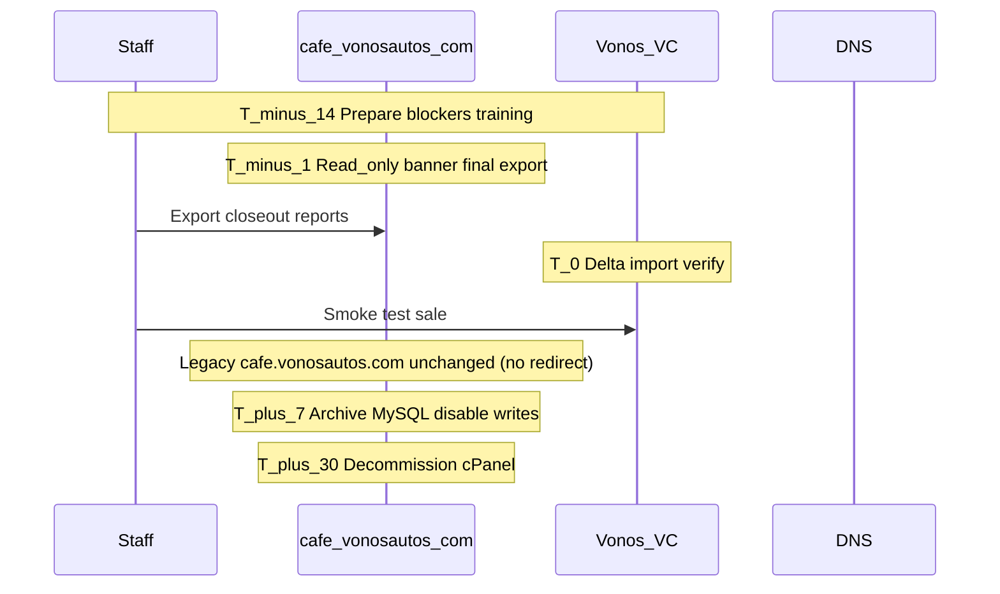

# VC — Cutover Plan (Retire `cafe.vonosautos.com`)

**Target:** Move Vonos Cafe operations from Ultimate POS on `cafe.vonosautos.com` to Vonos platform tenant **`tenant_vc_001` (VC)**.  
**Prepared:** 2026-06-23  
**Prerequisites:** [VC_CAFE_SITE_AUDIT.md](./VC_CAFE_SITE_AUDIT.md), [VC_LEGACY_GAP_ANALYSIS.md](./VC_LEGACY_GAP_ANALYSIS.md)

---

## Goals

1. **Zero data loss** for sales, payments, menu items, customers, and finance history.
2. **Minimal downtime** (target: one maintenance window, &lt; 4 hours).
3. **Rollback option** for 7 days if Vonos VC blocks daily operations.
4. **Decommission** legacy cPanel hosting within 30 days after stable cutover.

---

## Open decisions (confirm before T-0)

| Decision | Options | Recommendation |
|---|---|---|
| **Production URL** | A) Replace `cafe.vonosautos.com` with Vonos app B) `app.vonosautos.com/VC` only (no legacy redirect) | **B — locked** — staff use `https://app.vonosautos.com/VC`; **do not** redirect `cafe.vonosautos.com` |
| **Kitchen display** | Ship `kitchenStatus` fix vs waive for v1 | **Waived** — ops confirmed POS-only; Kitchen removed from VC nav |
| **Timezone** | Keep Kolkata vs Lagos | **`Africa/Lagos`** on Vonos tenant |
| **Credential rotation** | Rotate DB/app keys after backup exposure | **Yes** — `cafe_backup.zip` contained live `.env` |

---

## Cutover blockers (must pass)

| # | Blocker | Owner | Verification |
|---|---|---|---|
| B1 | Vonos VC deployed to production URL with valid SSL | DevOps | Login as `admin@vc.vonos` (or production invite) |
| B2 | Delta MySQL import through cutover freeze | Migration | Counts ≥ legacy; ledger revenue tie-out |
| B3 | Staff accounts in Vonos (2 legacy users) | Admin | Invites accepted; roles `admin` / `staff` |
| B4 | POS smoke test | Ops + Dev | Create order → payment → ledger → stock decrement |
| B5 | Finance / Reports spot check | Ops | Overview KPIs, Finance ledger, Daily Closeout tab |
| B6 | Kitchen gap waived **or** fixed | Product | **Waived** (2026-06-23) — no kitchen screen needed |
| B7 | Secrets rotated if backup shared | Security | DB password, `APP_KEY`, payment keys |

**Non-blockers (post-cutover OK):** Cafe table seeding, modifier editor, receipt printer integration, cash register sessions, 13 account-txn dedupe.

---

## Current baseline (2026-06-23)

| Source | Sales | Items | Ledger revenue (NGN) |
|---|---:|---:|---:|
| Legacy MySQL (audit Jun 18) | 4,224 imported / 4,226 sell type | 59 | — |
| Postgres `tenant_vc_001` | 4,224 | 59 | 4,241,976.56 |

Ledger revenue **equals** sum of completed sale totals (₦0.00 delta). Assume **delta sales** exist between last import (Jun 15 dump) and freeze export.

---

## Timeline



| Phase | When | Actions |
|---|---|---|
| **Prepare** | T−14 → T−7 | Fix blockers B1–B7; train staff on `/VC/orders`, POS, Finance; parallel run (legacy primary) |
| **Freeze** | T−1 (e.g. evening) | Announce downtime; post read-only notice on legacy login; **no new legacy sales** after freeze time |
| **Export** | T−1 | Full `mysqldump` of `vonomglk_cafe` + download Ultimate POS backup from cPanel |
| **Delta import** | T−0 | Re-run VC migration with `--write --confirm-tenant VC` on fresh dump |
| **Verify** | T−0 | Row counts, ledger tie-out, spot-check 5 recent invoices |
| **Switch** | T−0 | Staff begin using `app.vonosautos.com/VC`; **no** DNS change or redirect on `cafe.vonosautos.com` |
| **Stabilize** | T+1 → T+7 | Monitor errors; hotfix; staff feedback; no legacy writes |
| **Decommission** | T+30 | Cancel hosting; retain cold MySQL + `cafe_backup.zip` encrypted offline |

---

## T−0 runbook (maintenance window)

### 1. Freeze legacy (15 min)

- [ ] Confirm no staff logged into Ultimate POS
- [ ] Put site in maintenance mode **or** change DB user to read-only (if available)
- [ ] Export `vonomglk_cafe` via phpMyAdmin / `mysqldump`

### 2. Import delta (30–60 min)

From repo root (with `apps/api/.env` `DATABASE_URL` set):

```bash
# Example — adjust script path to your fresh dump file
PYTHONPATH=scripts python3 scripts/migrate_all.py \
  --source-sql /path/to/vonomglk_cafe_final.sql \
  --entities VC \
  --write \
  --confirm-tenant VC
```

- [ ] Review import summary JSON / log
- [ ] Optional: `PYTHONPATH=scripts python3 scripts/migration/dedupe_tenant.py --entity VC --execute`

### 3. Verify Postgres (15 min)

- [ ] `Sale` count ≥ previous + delta
- [ ] `SUM(LedgerEntry revenue)` = `SUM(Sale.total)` for completed sales
- [ ] Sample 5 latest sales: lines, customer, payment status
- [ ] Menu item count = 59 (+ any new products since audit)

### 4. Vonos functional smoke (30 min)

- [ ] Login to Vonos VC production
- [ ] Overview KPIs load
- [ ] `/VC/orders` — list loads, open detail
- [ ] POS — create test order (void/refund if supported, else note test sale)
- [ ] Finance — ledger tab, filter last 7 days
- [ ] Reports — Sales + Daily Closeout tabs

### 5. Go-live (no legacy redirect)

**Decision (locked):** Do **not** redirect `cafe.vonosautos.com` to Vonos. Staff use **`https://app.vonosautos.com/VC`** directly.

- Leave `cafe.vonosautos.com` DNS and hosting unchanged (legacy can stay read-only or be decommissioned later without a redirect).
- Share the new URL via staff training / WhatsApp — not via domain redirect.
- Do **not** add Cloudflare or cPanel 301 rules from `cafe.vonosautos.com` to the Vonos app.

### 6. Communicate (15 min)

- [ ] WhatsApp / staff channel: new URL, login emails, support contact
- [ ] Post-mortem slot T+3

---

## Rollback plan (7 days)

**Trigger:** Cannot complete sales, ledger mismatch &gt; ₦10,000, or &gt; 50% staff blocked.

| Step | Action |
|---|---|
| 1 | Staff revert to legacy `cafe.vonosautos.com` if still hosted (no redirect to undo) |
| 2 | Restore MySQL from T−1 snapshot if legacy DB was touched |
| 3 | Document Vonos-only sales created during failed cutover — **manual reconciliation** (no auto back-sync) |
| 4 | Postpone cutover; fix blockers; reschedule |

**Note:** Sales created in Vonos after switch **do not** sync back to Ultimate POS automatically.

---

## Post-cutover checklist (T+1 → T+30)

| Day | Task |
|---|---|
| T+1 | Confirm all shifts used Vonos only |
| T+3 | Review Finance totals vs legacy closeout export |
| T+7 | Disable legacy PHP app (maintenance page only); keep MySQL read-only backup |
| T+14 | Seed `CafeTable` rows if floor management needed |
| T+30 | Export final MySQL archive; cancel cPanel subscription |
| T+30 | Rotate legacy DB credentials (invalidate) |

---

## Staff mapping

| Legacy (`users` table) | Vonos action |
|---|---|
| 2 staff accounts (usernames in legacy DB) | Create invites per tenant; assign `admin` / `staff` |
| Seed `admin@vc.vonos` | Production admin email TBD — replace seed or add real admin |

**Training topics (1–2 h):**

- Login / password reset
- POS: `/VC/orders` + pos-terminal
- Menu: `/VC/menu-items`
- Finance & Reports (closeout tab)
- What **not** to use yet: kitchen board (if waived), empty tables until seeded

---

## Risk register

| Risk | Likelihood | Impact | Mitigation |
|---|---|---|---|
| Missing sales in delta import | Medium | High | Freeze + fresh dump; count verify |
| Kitchen board confusion | Medium | Low | Waive + hide nav or document “not used” |
| Receipt printing regression | Medium | Medium | Keep browser print from POS detail interim |
| Timezone KPI skew | Low | Medium | Set Lagos on Vonos tenant |
| Credential leak from zip | Medium | High | Rotate secrets |
| Staff resistance | Medium | Medium | Parallel training week |

---

## Success criteria

- [ ] All blockers B1–B7 passed
- [ ] Staff use `app.vonosautos.com/VC` (no redirect from `cafe.vonosautos.com`)
- [ ] First full business day completed on Vonos VC without rollback
- [ ] Finance revenue within ₦0.01 of legacy export for same date range
- [ ] Legacy hosting decommission scheduled T+30

---

## Related documents

| Doc | Purpose |
|---|---|
| [VC_CAFE_SITE_AUDIT.md](./VC_CAFE_SITE_AUDIT.md) | Legacy site health |
| [VC_LEGACY_GAP_ANALYSIS.md](./VC_LEGACY_GAP_ANALYSIS.md) | Feature & data gaps |
| [VC_MIGRATION_MAP.md](./VC_MIGRATION_MAP.md) | ETL field rules |
| [VC_AUDIT.md](./VC_AUDIT.md) | MySQL inventory |
