# VC Legacy vs Vonos — Gap Analysis

Compares the legacy Ultimate POS deployment (`cafe.vonosautos.com` / `vonomglk_cafe`) to the current Vonos VC stack: architecture, query patterns, migrated data, and remaining gaps.

See also: [VC_CAFE_SITE_AUDIT.md](./VC_CAFE_SITE_AUDIT.md), [VC_MIGRATION_MAP.md](./VC_MIGRATION_MAP.md), [VC_AUDIT.md](./VC_AUDIT.md), [VC_CAFE_SQL_DELTA.md](./VC_CAFE_SQL_DELTA.md), [VC_CUTOVER_PLAN.md](./VC_CUTOVER_PLAN.md).

---

## Side-by-side architecture

```mermaid
flowchart TB
  subgraph legacy [Legacy Ultimate POS]
    Browser1[Blade + jQuery AdminLTE]
    WebRoutes[routes/web.php]
    Controllers[SellPosController Restaurant controllers]
    Utils[TransactionUtil ProductUtil]
    Eloquent[Eloquent ORM]
    MySQL[(vonomglk_cafe MySQL)]
    Browser1 --> WebRoutes --> Controllers --> Utils --> Eloquent --> MySQL
  end

  subgraph vonos [Vonos VC today]
    Browser2[Next.js + React Query]
    ApiClient[lib/api/*.ts]
    Nest[NestJS modules]
    Services[SalesService CafeTablesService]
    TenantDb[TenantDbService + Prisma extends]
    Postgres[(Neon Postgres tenant_vc_001)]
    Browser2 --> ApiClient --> Nest --> Services --> TenantDb --> Postgres
  end
```

| Dimension | Legacy (cafe) | Vonos VC (current) |
|---|---|---|
| App | Laravel 9.52.4 monolith | NestJS API + Next.js frontend |
| HTTP | Session auth, `/pos`, restaurant kitchen routes | JWT Bearer, REST `/sales`, `/items`, `/cafe-tables`, `/ledger` |
| Business logic | `TransactionUtil.php`, restaurant Blade views | Thin services per domain |
| Data model | Polymorphic `transactions` + `variations` | `Sale`, `SaleLine`, `Item`, `LedgerEntry`, `CafeTable` |
| Tenancy | Single `business_id` | Shared Postgres, `tenantId = tenant_vc_001` |
| Stock atom | `variation_location_details.qty_available` | `Item.quantity` (one row per variation) |
| Finance | `account_transactions` + Accounting module | `LedgerEntry` + Finance template |
| Restaurant | Kitchen/table/modifier UI in Ultimate POS | Kitchen kanban + table grid in Vonos (data mostly greenfield) |

---

## How the Vonos backend is structured (VC)

**Layering (per request):**

1. **Guards** — `JwtAuthGuard` → `TenantGuard` → `RolesGuard`
2. **JWT payload** — `{ userId, tenantId, role }`
3. **Request-scoped DB** — `TenantDbService` + Prisma `$extends` tenant scoping
4. **Domain modules** — `sales`, `items`, `customers`, `ledger`, `payments`, `reports`, `overview`, **`cafe-tables`**

**VC-specific behavior:**

- **Shell nav** ([`tenantConfigs.ts`](../../apps/web/lib/registries/tenantConfigs.ts)): Overview, Kitchen, Tables, Suppliers, Finance, Users, Settings.
- **POS nav** ([`posNavSections.ts`](../../apps/web/lib/registries/posNavSections.ts)): Sell → `/VC/orders`, Products → `/VC/menu-items`, Payment Accounts, Reports (incl. Daily Closeout tab).
- **Kitchen display** ([`KitchenDisplayView.tsx`](../../apps/web/components/pages/KitchenDisplayView.tsx)): kanban grouped by `orderStatus` vocabulary — fed by [`saleToOrder()`](../../apps/web/lib/api/orders.ts).
- **Table management** ([`TableManagementView.tsx`](../../apps/web/components/pages/TableManagementView.tsx)): `CafeTable` CRUD via [`cafe-tables` module](../../apps/api/src/modules/cafe-tables/) — **0 rows** in Postgres today.

**Migration ETL:** `scripts/migrate_all.py` / entity registry `VC` → `vonomglk_cafe` → `tenant_vc_001` ([`migration_registry.py`](../../scripts/migration_registry.py)).

---

## What was migrated (data in Postgres)

Verified **2026-06-23** (live Postgres) vs [VC_MIGRATION_DRYRUN.json](./dryruns/VC_MIGRATION_DRYRUN.json) (Jun 15 import):

| Entity | Postgres | Import (Jun 15) | Legacy source |
|---|---:|---:|---|
| Items | 59 | 59 | `products` / `variations` |
| Customers | 47 | 47 | `contacts` (customer) |
| Suppliers | 4 | 4 | `contacts` (supplier) |
| Sales | 4,224 | 4,224 | `transactions` sell/`final` |
| Sale lines | 7,255 | 7,255 | `transaction_sell_lines` |
| Ledger entries | 4,400 | 4,400 | revenue + expense derived |
| Payments | 4,847 | 4,847 | `transaction_payments` |
| Payment accounts | 3 | 3 | `accounts` |
| Account transactions | 3,537 | 3,537 | `account_transactions` |
| MigrationLegacyId rows | 9,253 | 9,253 | all mapped entities |
| CafeTable | 0 | — | legacy `res_tables` empty |

**Sell count gap:** Legacy has **4,226** `type=sell` rows; **4,224** became `Sale` — **2 rows** excluded (non-final or map filter). See [VC_MIGRATION_MAP.md](./VC_MIGRATION_MAP.md) §3.

**Finance tie-out:** `SUM(LedgerEntry revenue) = SUM(Sale.total completed) = ₦4,241,976.56` (exact match).

**Dedupe status:** No VSS-style 3× inflation. Dry-run reports **3 duplicate customers** and **13 duplicate account transactions** — optional cleanup via `python3 scripts/migration/dedupe_tenant.py --entity VC --execute` (from repo root with `PYTHONPATH=scripts`).

**Post-import delta (cafe.sql, Jun 23 2026):** Legacy now has **4,382** sell+final transactions (was 4,138 in Jun 15 audit), max date **2026-06-23**. Postgres still reflects Jun 15/16 import — **+158 sales** pending per [VC_CAFE_SQL_DELTA.md](./VC_CAFE_SQL_DELTA.md). Run full re-import from `cafe.sql` at T−0.

**Intentionally not migrated** (per [VC_MIGRATION_MAP.md](./VC_MIGRATION_MAP.md)):

- FIFO (`transaction_sell_lines_purchase_lines`, 7,329 rows)
- Users/passwords, OAuth, Essentials HR
- `res_product_modifier_sets` (empty anyway)
- WooCommerce / Connector sync state

---

## Feature parity matrix

| Legacy capability | Vonos VC status | Gap severity |
|---|---|---|
| POS checkout (`/pos`) | `pos-terminal` + `AddOrderView` via POS nav | **Medium** — validate live sale + stock + ledger |
| Menu catalog (59 items) | **Migrated** + `/VC/menu-items` | Low |
| Sales / orders history | **Migrated** + `/VC/orders` | Low |
| Walk-in customer | NULL `contact_id` supported | Low |
| Payment splits / accounts | **Migrated** payments + accounts | Low — run dedupe on 13 account txns optional |
| Cash register sessions | `cash_registers` (3), `cash_register_transactions` (2,966) | **Medium** — Vonos has no register session model |
| Kitchen display | Ultimate POS `restaurant/kitchen` | **High** — see § Kitchen gap |
| Table management | **Unused** in legacy (`res_tables` = 0) | **Low** — Vonos UI ready; seed `CafeTable` rows |
| Modifiers | **Unused** in legacy | **Low** — deferred; no Prisma modifier model |
| Daily closeout | Cash register + reports in Ultimate POS | **Medium** — Vonos Reports tab “Daily Closeout History” |
| Finance / P&L | Accounting module | **Medium** — verify Finance KPIs after delta import |
| Expenses (176 txn) | Ledger expense rows | Low — ₦719,300 expenses in ledger |
| Opening stock (366 txn) | Item quantity seed | Low |
| Stock adjustments (31) | Not migrated as StockMovement | **Medium** — 0 `StockMovement` rows for VC |
| Users (2) | Seed `admin@vc.vonos` only | **High** — invite/map legacy staff |
| Receipt printing | `browser` / printer config on location | **Medium** — not in Vonos |
| Repair module login branding | `SHOW_REPAIR_STATUS_LOGIN_SCREEN=true` | Low on legacy; N/A on Vonos |
| Multi-language UI (16 langs) | English Vonos shell | Low |
| WooCommerce / Connector | Enabled in legacy modules | **Out of scope** — not in Vonos |

---

## Critical gap — Kitchen / order status

**Legacy:** `transactions.is_kitchen_order`, `res_order_status` (`received` / `cooked` / `served`), kitchen Blade UI.

**Vonos today:**

- `SaleStatus` enum: `completed | refunded | partially_refunded | draft` only ([`schema.prisma`](../../apps/api/prisma/schema.prisma)).
- [`saleToOrder()`](../../apps/web/lib/api/orders.ts) maps UI kitchen columns via `ORDER_STATUS_MAP` — all completed sales become **“Served”**.
- Kitchen kanban therefore shows **historical completed orders in one column**, not an operational kitchen queue.

**Operational assessment:** With **zero tables** and **zero modifier sets**, staff likely used **standard POS finalization**, not kitchen workflow. **Waiving kitchen parity for v1 cutover is reasonable** if ops confirms they never used the kitchen screen.

**If kitchen is required post-cutover:**

1. Add `kitchenStatus` (or `orderStatus`) on `Sale` + migration mapping from `res_order_status`.
2. Filter kitchen board to `draft` / open orders only.
3. Add status transition API for “Mark Preparing / Ready / Served”.

---

## Shell vs POS navigation

| AGENTS.md slot | Vonos route | In shell sidebar? | In POS nav? |
|---|---|---|---|
| Overview | `/VC/overview` | Yes | — |
| Orders (primary list) | `/VC/orders` | No | Yes (Sell) |
| Menu items | `/VC/menu-items` | No | Yes (Products) |
| Kitchen display | `/VC/kitchen` | Yes | — |
| Table management | `/VC/tables` | Yes | — |
| Daily closeout | Reports → closeout tab | No | Yes (Reports) |
| Suppliers | `/VC/suppliers` | Yes | — |
| Finance | `/VC/finance` | Yes | — |
| Users / Settings | `/VC/users`, `/VC/settings` | Yes | — |

Matches VSS pattern: core ops live under **POS nav groups**, not all in the left shell.

---

## Behavioral notes

1. **New sales** on Vonos should decrement stock and post ledger revenue (same pattern as VSS `sales.service.ts`) — **smoke-test before cutover**.
2. **Re-import** from fresh MySQL dump is idempotent via `MigrationLegacyId` + `ON CONFLICT DO NOTHING`.
3. **Timezone:** Standardize **`Africa/Lagos`** on Vonos tenant config; legacy used Asia/Kolkata.
4. **Tables:** Configure `CafeTable` records in Vonos after cutover (legacy had none).

---

## Recommended next steps (implementation, not in this doc)

| Priority | Item |
|---|---|
| P0 | Delta import from production MySQL |
| P0 | Staff invites (2 legacy users) |
| P0 | POS + Finance smoke test on Vonos VC |
| P1 | Optional dedupe (`--entity VC --execute`) |
| P1 | Seed cafe tables if floor plan needed |
| P2 | `kitchenStatus` schema + kitchen board fix |
| P2 | StockMovement backfill for adjustments |
| P3 | Cash register parity |
| P3 | Modifier editor section type |

---

## Key files

| Topic | Path |
|---|---|
| Site audit | [VC_CAFE_SITE_AUDIT.md](./VC_CAFE_SITE_AUDIT.md) |
| Cutover plan | [VC_CUTOVER_PLAN.md](./VC_CUTOVER_PLAN.md) |
| VC tenant config | `apps/web/lib/registries/tenantConfigs.ts` |
| Entity pages | `apps/web/lib/registries/entityPages.tsx` |
| Kitchen UI | `apps/web/components/pages/KitchenDisplayView.tsx` |
| Orders adapter | `apps/web/lib/api/orders.ts` |
| Cafe tables API | `apps/api/src/modules/cafe-tables/` |
| Dedupe script | `scripts/migration/dedupe_tenant.py` |
| Migration registry | `scripts/migration_registry.py` |
