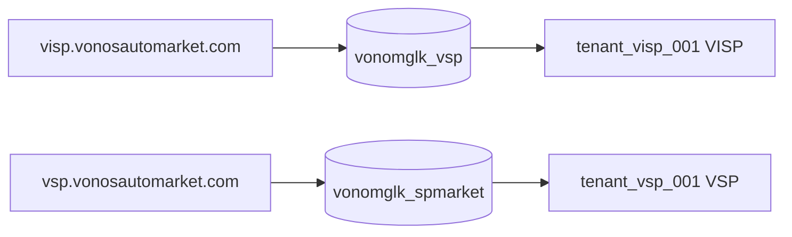

# VISP Legacy System — Architecture Reference

**Site:** `visp.vonosautomarket.com`  
**Product:** [Ultimate POS](https://ultimatefosters.com/) (Laravel 9, PHP 8+)  
**Vonos entity:** `VISP` → `tenant_visp_001`  
**MySQL database:** `vonomglk_vsp`  
**Business name in DB:** Vonos Institute Spare Parts  

Field-level migration: [VISP_MIGRATION_MAP.md](./VISP_MIGRATION_MAP.md).  
Database audit: [VISP_AUDIT.md](./VISP_AUDIT.md).  
Marketplace sibling: [VSP_LEGACY_ARCHITECTURE.md](./VSP_LEGACY_ARCHITECTURE.md).

---

## 1. Executive summary

| Artifact | Path | Role |
|---|---|---|
| PHP application | `visp.vonosautomarket.com/` | Full Ultimate POS install (institute spare-parts back office) |
| MySQL export (Jun 23) | `vonomglk_vsp.sql` | **Canonical VISP data** — ~5,466 txns, ~2,543 products, ~3,043 final sells |
| Full cPanel export | `localhost (1).sql` | All 12 account DBs; embedded `vonomglk_vsp` is Jun 18 baseline |

Ultimate POS is a monolithic Laravel MVC app. POS operations post to `routes/web.php`; business logic lives in `app/Utils/*Util.php` backed by a polymorphic `transactions` table.

**Important:** `vonomglk_vsp` belongs to **VISP** (this site), not VSS/VSP. The separate marketplace at `vsp.vonosautomarket.com` uses **`vonomglk_spmarket`** — see VSP docs.

---

## 2. Site ↔ database matrix (corrected)

| Public URL | App folder | MySQL DB | Vonos tenant | Scale (Jun 23) |
|---|---|---|---|---|
| `visp.vonosautomarket.com` | `visp.vonosautomarket.com/` | `vonomglk_vsp` | `tenant_visp_001` (VISP) | Large institute catalog + ~3k sales |
| `vsp.vonosautomarket.com` | `vsp.vonosautomarket.com/` | `vonomglk_spmarket` | `tenant_vsp_001` (VSP) | Smaller marketplace — ~162 sales |



---

## 3. Stack and deployment

| Layer | Technology |
|---|---|
| Framework | Laravel 9 |
| Auth | Session + Spatie permissions |
| API | Passport installed; POS uses web routes only |
| Modules | `nwidart/laravel-modules` — Essentials, WooCommerce, Accounting, etc. enabled in config |
| Payments | Pesapal, MyFatoorah |

### Enabled modules (`modules_statuses.json`)

Same core set as VSP except VISP lacks `Gym` and `ZatcaIntegrationKsa` (present on VSP only).

### Data-backed features (VISP-specific)

| Feature | Routes/controllers | Data in `vonomglk_vsp` |
|---|---|---|
| POS sales | `SellPosController`, `SellController` | 3,043 `sell` + `final` |
| Opening stock | `ProductController` import | 2,420 `opening_stock` rows |
| Payroll / Essentials | Essentials module tables | 588 `essentials_payroll_group_transactions` |
| Product racks | `ProductController` | 1,848 `product_racks` rows |
| Sell returns | `SellReturnController` | **0** `sell_return` txns (routes exist, unused) |
| Purchases / expenses | `PurchaseController`, `ExpenseController` | Not present as txn types in export |

---

## 4. Routing

### Web routes (primary)

| Domain | Controller | Purpose |
|---|---|---|
| POS | `SellPosController` | Register checkout |
| Sales | `SellController` | Sale list/detail |
| Products | `ProductController` | SKU catalog, stock |
| Contacts | `ContactController` | Customers/suppliers |
| Reports | `ReportController` | Stock, sales, tax |
| Accounts | `AccountController` | Payment accounts / ledger |

### REST API (`routes/api.php`)

Passport scaffold only — no sell/product endpoints in core `api.php`.

---

## 5. Data model (migration-relevant)

### Transaction types in `vonomglk_vsp`

| `type` | Count | Vonos mapping |
|---|---:|---|
| `sell` | 3,046 | `Sale` + `SaleLine` + `LedgerEntry` |
| `opening_stock` | 2,420 | Seeds `Item.quantity` |

### Core join path for items

```
products → variations → variation_location_details (qty)
```

Item legacy key = `variations.id` (sell lines reference `variation_id`).

---

## 6. Vonos target

| Legacy | Vonos |
|---|---|
| `vonomglk_vsp` | `tenant_visp_001` |
| Ultimate POS transaction-centric | Vonos transaction archetype (Sales, Customers, Finance) |
| ETL | `migrate_all.py --entities VISP --dump vonomglk_vsp.sql` |

Dry-run counts (Jun 23): 2,543 items, 3,043 sales, 4,682 customers — see [dryruns/VISP_MIGRATION_DRYRUN.json](./dryruns/VISP_MIGRATION_DRYRUN.json).

---

## 7. Related documents

| Doc | Purpose |
|---|---|
| [VISP_AUDIT.md](./VISP_AUDIT.md) | Table inventory, schema, txn mix |
| [VISP_VSP_SQL_DELTA.md](./VISP_VSP_SQL_DELTA.md) | Jun 18 → Jun 23 delta + tie-out |
| [VISP_MIGRATION_MAP.md](./VISP_MIGRATION_MAP.md) | Field-level ETL |
| [VISP_LEGACY_GAP_ANALYSIS.md](./VISP_LEGACY_GAP_ANALYSIS.md) | Legacy vs Vonos gaps |
| [VISP_VSP_BACKEND_DIFF.md](./VISP_VSP_BACKEND_DIFF.md) | Code diff vs VSP site |
