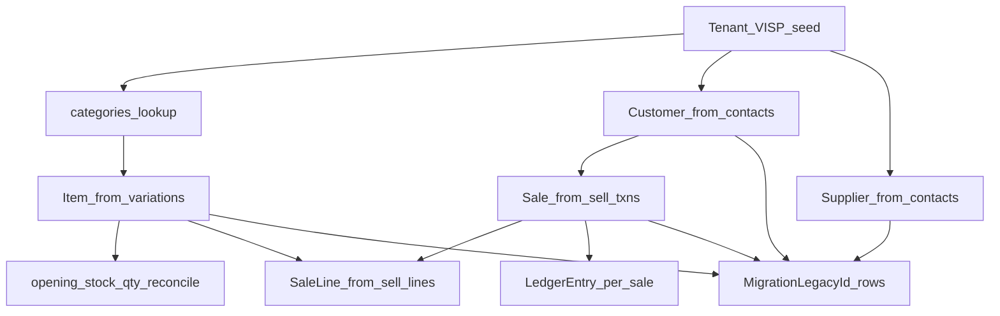

# VISP — Field-Level Migration Map

**Target entity:** Vonos Institute Spare Parts (`VISP`, tenant code `VISP`, seed id `tenant_visp_001`)  
**Canonical source:** `vonomglk_vsp` — standalone `vonomglk_vsp.sql` (Jun 23 2026) or embedded section in `localhost (1).sql`  
**Architecture reference:** [VISP_LEGACY_ARCHITECTURE.md](./VISP_LEGACY_ARCHITECTURE.md)  
**Audit reference:** [VISP_AUDIT.md](./VISP_AUDIT.md)  
**Sibling entity:** [VSP_MIGRATION_MAP.md](./VSP_MIGRATION_MAP.md) (`vonomglk_spmarket` — separate tenant)

---

## 1. Scope

### In scope (VISP v1)

| Source table(s) | Vonos target |
|---|---|
| `products`, `variations`, `product_variations`, `variation_location_details`, `categories` | `Item` |
| `contacts` (customer) | `Customer` |
| `contacts` (supplier) | `Supplier` |
| `transactions` (`type = sell`) | `Sale`, `SaleLine`, `LedgerEntry` |
| `transaction_sell_lines` | `SaleLine` |
| `transaction_payments` | `Sale.paymentStatus` enrichment (optional v1) |
| `transactions` (`type = opening_stock`) + `purchase_lines` | `Item.quantity` seed / validation only |
| All migrated entities | `MigrationLegacyId` lookup rows |

### Out of scope (skip for VISP v1)

| Source | Reason |
|---|---|
| `transaction_sell_lines_purchase_lines` | FIFO costing (23,494 rows) — not needed in Vonos v1 |
| `account_transactions`, `cash_registers`, `accounts` | POS accounting subsystem; Vonos uses `LedgerEntry` only |
| `essentials_*` | HR/payroll module |
| `oauth_*`, `activity_log`, `media` | Auth/audit noise |
| `users` | Re-invite via Vonos auth; **do not** import `password_hash` |
| `sell_return` | Not present in VISP export (`transactions.type` has only `sell` + `opening_stock`) |
| `woocommerce_*` | No WooCommerce order rows in VISP export |
| `purchase`, `expense`, `payroll` | Not present as transaction types in VISP export |

---

## 2. Import order

Dependencies must be respected:



1. Ensure `Tenant` row exists (`code: VISP`, `archetype: transaction`).
2. Build in-memory `categories` id → name map.
3. Import **Items** (one row per `variation_id`).
4. Apply **opening stock** reconciliation on `Item.quantity`.
5. Import **Customers** and **Suppliers** from `contacts`.
6. Import **Sales** (`transactions.type = 'sell'`, `status = 'final'`).
7. Import **Sale lines** joined to sell transactions.
8. Create **LedgerEntry** (revenue) per completed sale.
9. Write **MigrationLegacyId** rows for all mapped legacy integers.

---

## 3. ID strategy

Use `MigrationLegacyId` in Postgres:

| Field | Value |
|---|---|
| `tenantId` | Vonos tenant cuid for VISP |
| `entityType` | `item` \| `customer` \| `supplier` \| `sale` |
| `legacyId` | Original MySQL `INT` primary key |
| `newId` | New Vonos cuid |

**Item legacy key:** `variations.id` (not `products.id`) — sell lines reference `variation_id`.

**Walk-in sales:** When `transactions.contact_id` is NULL, set `Sale.customerId` to NULL and `customerName` to `"Walk-in"` at read/transform time.

---

## 4. Item mapping

**Join path:**

```
products
  → variations ON variations.product_id = products.id
  → variation_location_details ON variation_id = variations.id
```

(`product_variations` in Ultimate POS is a template/dummy row table — not the variation SKU join.)

Filter `variation_location_details.location_id` to the primary location from `business_locations` (first active location for the business).

| Source field | Target `Item` | Transform rule |
|---|---|---|
| `variations.sub_sku` | `sku` | Prefer `sub_sku`; fallback `products.sku` |
| `products.name` | `name` | If `products.type = 'variable'`, append `variations.name` when not `DUMMY` |
| `categories.name` via `products.category_id` | `category` | String lookup; null if uncategorized |
| `variation_location_details.qty_available` | `quantity` | `int(truncate(qty))`; reconcile with opening stock (§7) |
| `variations.default_purchase_price` | `costPrice` | Decimal; default `0` if null |
| `products.alert_quantity` | `reorderPoint` | Nullable int |
| — | `currency` | `"NGN"` |
| — | `availableForRetail` | `true` for VISP catalog items (retail module) |
| — | `status` | See §6 |
| `variations.id` | `MigrationLegacyId` | `entityType: item` |

**Expected count:** ~2,642 variations / ~2,343 with location qty rows (per VISP audit).

---

## 5. Customer mapping

**Filter:** `contacts.type IN ('customer', 'both')`

| Source field | Target `Customer` | Transform rule |
|---|---|---|
| `name` | `name` | First non-empty: `name`, `supplier_business_name`, `trim(first_name + ' ' + last_name)` |
| `email` | `email` | Nullable; empty string → null |
| `mobile` | `phone` | Normalize whitespace; required in source |
| — | `totalSpend` | **Computed** post-import from sum of `Sale.total` per customer |
| — | `visitCount` | **Computed** post-import: count of sales per customer |
| `contacts.id` | `MigrationLegacyId` | `entityType: customer` |

**Expected count:** subset of 4,799 total contacts (customer + supplier + both types).

---

## 6. Supplier mapping

**Filter:** `contacts.type IN ('supplier', 'both')`

| Source field | Target `Supplier` | Transform rule |
|---|---|---|
| `supplier_business_name` or `name` | `name` | Business name preferred |
| `name` | `contactName` | Person name if distinct from business name |
| `email` | `email` | Nullable |
| `mobile` | `phone` | Nullable |
| `address_line_1` | `address` | Concat line 1 + line 2 if present |
| `contacts.id` | `MigrationLegacyId` | `entityType: supplier` |

---

## 7. Sale mapping

**Filter:** `transactions.type = 'sell'` AND `status = 'final'` (exclude 3 draft rows)

| Source field | Target `Sale` | Transform rule |
|---|---|---|
| `invoice_no` | `reference` | Prefer `invoice_no`; fallback `ref_no`; fallback `VISP-{id}` |
| `contact_id` | `customerId` | Via `MigrationLegacyId`; null allowed |
| `transaction_date` | `date` | Parse as UTC datetime |
| `final_total` | `total` | Decimal |
| — | `currency` | `"NGN"` |
| `payment_status` | `paymentStatus` | `paid` → `paid`, `partial` → `partial`, `due` → `due`, null → `paid` if status final |
| `status` | `status` (Prisma) | `final` → `completed`; `draft` → `draft` (skip drafts v1) |
| `transactions.id` | `MigrationLegacyId` | `entityType: sale` |

**UI status labels** (StatusPill `saleReturnStatus`): map Prisma `completed` → `"Completed"`, `refunded` → `"Refunded"`.

**Expected count:** 3,016 sell transactions (3,013 final + 3 draft).

---

## 8. Sale line mapping

**Join:** `transaction_sell_lines.transaction_id` → sell `transactions.id`

| Source field | Target `SaleLine` | Transform rule |
|---|---|---|
| `transaction_id` | `saleId` | Via sale legacy map |
| `variation_id` | `itemId` | Via item legacy map; null + flag if orphan |
| `product_id` | — | Used only for name fallback |
| `quantity` | `quantity` | Decimal preserved |
| `unit_price` or `unit_price_inc_tax` | `unitPrice` | Use `unit_price_inc_tax` when business `sell_price_tax = includes` |
| `unit_price_inc_tax * quantity` (or line total fields) | `lineTotal` | Prefer explicit line total column if present |
| `variations.sub_sku` / product name | `sku`, `name` | Denormalized for audit trail |
| `line_discount_type`, `line_discount_amount` | `discountAmount` | Optional v1; sum fixed + percent-derived |

**Expected count:** 18,595 total sell lines in VISP export.

---

## 9. Ledger mapping

One `LedgerEntry` per imported sale:

| Source / derived | Target `LedgerEntry` | Transform rule |
|---|---|---|
| — | `type` | `revenue` |
| `final_total` | `amount` | Same as sale total |
| — | `currency` | `"NGN"` |
| — | `category` | `"Sales"` |
| `invoice_no` or sale reference | `description` | `"Sale {reference}"` |
| sale cuid | `linkedRecordType`, `linkedRecordId` | `sale` / `{saleId}` |
| `transaction_date` | `date` | Same as sale date |
| — | `tenantId` | VISP tenant |

---

## 10. Opening stock (quantity seed only)

**Filter:** `transactions.type = 'opening_stock'`

- Do **not** create `Sale` or `StockMovement` rows.
- Join `purchase_lines` on `transaction_id` → get `variation_id` + `quantity`.
- For each variation, if `variation_location_details.qty_available` is missing or zero, set `Item.quantity` from opening stock qty.

**Conflict rule:** When both VLD and opening stock provide quantity, **prefer `variation_location_details.qty_available`**.

**Expected count:** 2,334 opening_stock transactions; 2,334 purchase_lines.

---

## 11. Transform rules

### Stock status (`Item.status`)

| Condition | `StockStatus` |
|---|---|
| `quantity <= 0` | `out_of_stock` |
| `reorderPoint` set and `quantity <= reorderPoint` | `low_stock` |
| Otherwise | `in_stock` |

### Payment status

| Ultimate POS `payment_status` | Vonos `PaymentStatus` |
|---|---|
| `paid` | `paid` |
| `partial` | `partial` |
| `due` | `due` |
| NULL (on final sale) | `paid` |

### Sale status

| Ultimate POS `status` | Vonos `SaleStatus` | UI label |
|---|---|---|
| `final` | `completed` | Completed |
| `draft` | `draft` | (skip import v1) |
| return types (future) | `refunded` / `partially_refunded` | Refunded |

---

## 12. Validation checklist

Compare dry-run / import counts against [VISP_AUDIT.md](./VISP_AUDIT.md):

| Metric | Expected (VISP) |
|---|---:|
| `products` | 2,543 |
| `variations` | 2,642 |
| `variation_location_details` | 2,343 |
| `contacts` | 4,814 |
| `transactions` (sell) | 3,046 |
| `transactions` (opening_stock) | 2,420 |
| `transaction_sell_lines` | 18,595 |
| Sales (dry-run) | 3,043 |
| Customers (dry-run) | ~4,682 |

**Integrity checks:**

- Orphan `transaction_sell_lines.variation_id` not in item map → report count
- Orphan `transactions.contact_id` not in customer map → allow (walk-in)
- Duplicate `invoice_no` within tenant → dedupe with suffix or fail loud
- `Sale.reference` unique per tenant

Run: `PYTHONPATH=scripts python3 scripts/migrate_all.py --dump vonomglk_vsp.sql --entities VISP --dry-run`

---

## 13. Open questions

1. **VW catalog sync vs local import:** Import VISP products as standalone `Item` rows; cross-tenant Warehouse query deferred per AGENTS.md §15.

2. **VSP sibling:** `vonomglk_spmarket` → `tenant_vsp_001` — see [VSP_MIGRATION_MAP.md](./VSP_MIGRATION_MAP.md).

3. **Returns:** No `sell_return` in VISP export. `SaleReturn` deferred.

4. **Tax lines:** `tax_amount` on transactions not broken into separate ledger categories v1 — included in sale total only.

---

## Related files

- ETL: [`scripts/migrate_visp_from_vsp.py`](../../scripts/migrate_visp_from_vsp.py) (wrapper) or `migrate_all.py --entities VISP`
- Prisma models: [`apps/api/prisma/schema.prisma`](../../apps/api/prisma/schema.prisma)
- Shared types: [`packages/types/src/sale.ts`](../../packages/types/src/sale.ts), [`customer.ts`](../../packages/types/src/customer.ts)
- Pipeline: [`docs/migration-pipeline.md`](../migration-pipeline.md)
