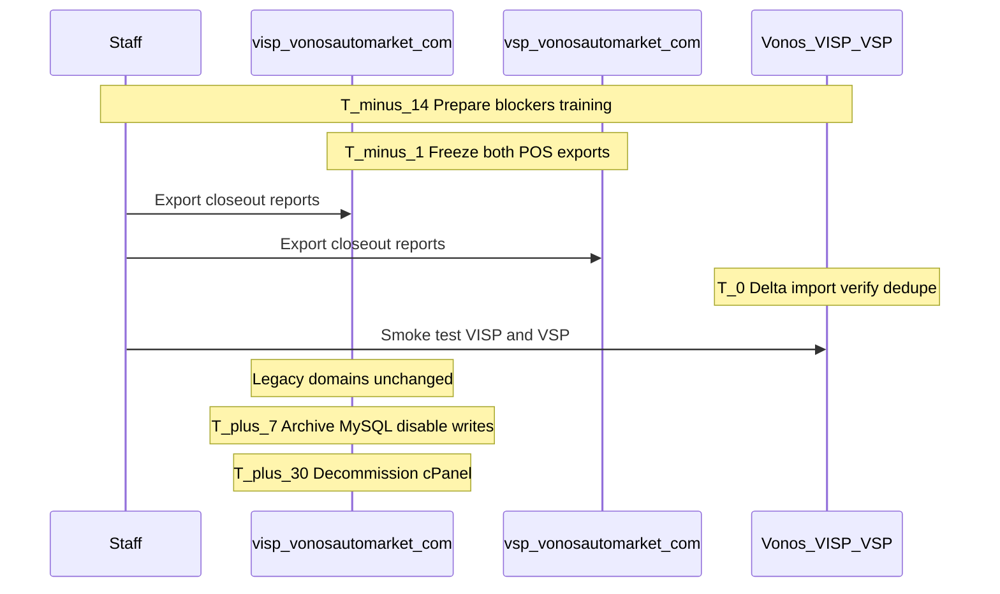

# VISP + VSP — Cutover Plan

**Target:** Move institute spare parts (`visp.vonosautomarket.com`) and marketplace
(`vsp.vonosautomarket.com`) from separate Ultimate POS installs to Vonos tenants
**`tenant_visp_001` (VISP)** and **`tenant_vsp_001` (VSP)**.

**Prepared:** 2026-06-16 (dev implementation)  
**Prerequisites:** [VISP_VSP_CUTOVER_NOTES.md](./VISP_VSP_CUTOVER_NOTES.md),
[VISP_MIGRATION_MAP.md](./VISP_MIGRATION_MAP.md), [VSP_MIGRATION_MAP.md](./VSP_MIGRATION_MAP.md)

---

## Goals

1. **Zero data loss** for sales, customers, catalog, payments, and finance history on both installs.
2. **Minimal downtime** (target: one maintenance window per site, &lt; 4 hours combined).
3. **Rollback option** for 7 days if either tenant blocks daily operations.
4. **Retire** legacy `VSS` label; staff use `/VISP` and `/VSP` on Vonos (legacy domains unchanged unless product decides otherwise).
5. **Decommission** legacy cPanel hosting within 30 days after stable cutover.

---

## Open decisions (confirm before T-0)

| Decision | Options | Recommendation |
|---|---|---|
| **Production URL** | A) Redirect legacy domains B) `app.vonosautos.com/VISP` + `/VSP` only | **B — locked** — staff use `https://app.vonosautos.com/VISP` and `/VSP`; no DNS redirect required |
| **VISP data path** | A) Re-key existing import B) Fresh import both tenants | **A — done in dev** — `tenant_vss_001` re-keyed to `tenant_visp_001`; delta import only at cutover |
| **Timezone** | Keep legacy vs Lagos | **`Africa/Lagos`** on Vonos tenants |
| **Credential rotation** | Rotate DB/app keys after backup exposure | **Yes** if dumps or `.env` were shared |

---

## Cutover blockers (must pass)

| # | Blocker | Owner | Verification |
|---|---|---|---|
| B1 | Vonos VISP + VSP deployed with valid SSL | DevOps | Login as `admin@visp.vonos` / `admin@vsp.vonos` |
| B2 | Delta MySQL import through cutover freeze (both DBs) | Migration | Counts ≥ legacy; ledger revenue tie-out |
| B3 | Staff accounts invited per entity | Admin | Invites accepted; roles assigned |
| B4 | POS smoke test (both tenants) | Ops + Dev | Create sale → payment → ledger |
| B5 | Finance / Reports spot check | Ops | Overview KPIs, Finance ledger |
| B6 | `/VSS/*` redirect works | Dev | `/VSS/sales` → `/VISP/sales` |
| B7 | VAG group overview shows all operating entities | Dev | 7 operating rows + roll-up charts |

**Non-blockers (post-cutover OK):** Pricing rules UI, cross-entity requisition flow, VAG consolidated P&amp;L transfer elimination.

---

## Dev baseline (post-implementation)

| Tenant | Items | Sales | Customers | Ledger revenue (NGN) | Sale total (NGN) |
|---|---:|---:|---:|---:|---:|
| **VISP** (`tenant_visp_001`) | 2,543 | 3,043 | 4,625 | 366,582,620 | 366,582,620 |
| **VSP** (`tenant_vsp_001`) | 1,200* | 162 | 86 | 11,043,950 | 11,043,950 |

\*VSP items 1,200 after dedupe (4 duplicate SKUs soft-deleted; dry-run import was 1,204).

Ledger revenue **equals** sum of completed sale totals (₦0.00 delta on both tenants).
`tenant_vss_001` **does not exist** after re-key.

Dry-run references: [dryruns/VISP_MIGRATION_DRYRUN.json](./dryruns/VISP_MIGRATION_DRYRUN.json),
[dryruns/VSP_MIGRATION_DRYRUN.json](./dryruns/VSP_MIGRATION_DRYRUN.json).

---

## Timeline



| Phase | When | Actions |
|---|---|---|
| **Prepare** | T−14 → T−7 | Fix blockers B1–B7; train staff on `/VISP/*` and `/VSP/*`; parallel run |
| **Freeze** | T−1 | Announce downtime; **no new legacy sales** after freeze on **both** sites |
| **Export** | T−1 | `mysqldump` of `vonomglk_vsp` + `vonomglk_spmarket` |
| **Delta import** | T−0 | `--write --confirm-all` per entity on fresh dumps |
| **Dedupe** | T−0 | `dedupe_tenant.py` for VISP and VSP |
| **Verify** | T−0 | Row counts, ledger tie-out, spot-check 5 recent sales each |
| **Switch** | T−0 | Staff use `app.vonosautos.com/VISP` and `/VSP` |
| **Stabilize** | T+1 → T+7 | Monitor; hotfix; no legacy writes |
| **Decommission** | T+30 | Cancel hosting; retain cold MySQL archives |

---

## T−0 runbook (maintenance window)

### 1. Freeze legacy (15 min each site)

- [ ] Confirm no staff logged into Ultimate POS on **either** install
- [ ] Maintenance mode or read-only DB user if available
- [ ] Export `vonomglk_vsp` and `vonomglk_spmarket`

### 2. Import delta (30–90 min)

From repo root (with `apps/api/.env` `DATABASE_URL` set):

```bash
# VISP — institute (delta only if data already in tenant_visp_001)
PYTHONPATH=scripts python3 scripts/migrate_all.py \
  --dump /path/to/vonomglk_vsp_final.sql \
  --entities VISP --write --confirm-all

# VSP — marketplace
PYTHONPATH=scripts python3 scripts/migrate_all.py \
  --dump /path/to/vonomglk_spmarket_final.sql \
  --entities VSP --write --confirm-all

# Dedupe both
PYTHONPATH=scripts python3 -m migration.dedupe_tenant \
  --tenant-code VISP --execute --confirm-tenant VISP
PYTHONPATH=scripts python3 -m migration.dedupe_tenant \
  --tenant-code VSP --execute --confirm-tenant VSP
```

- [ ] Review import summary JSON in `docs/migration-audits/dryruns/`

### 3. Verify Postgres (15 min)

- [ ] VISP: Items ≈ 2,543 (+ delta), Sales ≈ 3,043 (+ delta)
- [ ] VSP: Items ≈ 1,200, Sales = 162 (+ delta)
- [ ] `SUM(LedgerEntry revenue)` = `SUM(Sale.total)` per tenant
- [ ] Sample 5 latest sales per tenant: lines, customer, payment status
- [ ] No rows reference `tenant_vss_001`

### 4. Vonos functional smoke (45 min)

| Route | Check |
|---|---|
| `/VISP/overview` | KPIs load |
| `/VISP/sales`, `/VISP/catalog` | List + detail deep-links |
| `/VISP/finance` | Ledger + P&amp;L tabs |
| `/VSP/overview` | KPIs load (smaller dataset) |
| `/VSP/sales` | 162+ sales visible |
| `/VSS/sales` | Redirects to `/VISP/sales` |
| `/admin/overview` | All operating entities listed |
| `/admin/finance/VISP`, `/VSP` | Group admin views |

### 5. Go-live

**Decision (locked):** Staff use **`https://app.vonosautos.com/VISP`** and **`/VSP`**.
Legacy domains remain unchanged unless product adds redirects later.

### 6. Communicate (15 min)

- [ ] Staff channel: new URLs, login emails, support contact
- [ ] Post-mortem slot T+3

---

## Rollback plan (7 days)

**Trigger:** Cannot complete sales, ledger mismatch &gt; ₦10,000, or &gt; 50% staff blocked on either tenant.

| Step | Action |
|---|---|
| 1 | Staff revert to legacy POS URLs if still hosted |
| 2 | Restore MySQL from T−1 snapshot if legacy DB was touched |
| 3 | Document Vonos-only sales — **manual reconciliation** |
| 4 | Postpone cutover; fix blockers; reschedule |

Sales created in Vonos after switch **do not** sync back to Ultimate POS automatically.

---

## Post-cutover checklist (T+1 → T+30)

| Day | Task |
|---|---|
| T+1 | Confirm all shifts used Vonos only on both sites |
| T+3 | Review Finance totals vs legacy closeout exports |
| T+7 | Disable legacy PHP apps; keep MySQL read-only backup |
| T+14 | Invite remaining legacy users (~118 VISP dump users; most inactive) |
| T+30 | Export final MySQL archives; cancel cPanel subscriptions |
| T+30 | Rotate legacy DB credentials |

---

## Dev implementation notes (completed)

| Step | Status |
|---|---|
| Dedupe `tenant_vss_001` (~3k duplicate account transactions) | Done |
| Re-key `tenant_vss_001` → `tenant_visp_001` (`rekey-vss-to-visp.ts`) | Done |
| Seed + frontend/backend wiring (VISP, VSP; retire VSS) | Done |
| Import `vonomglk_spmarket.sql` → `tenant_vsp_001` | Done |
| Dedupe VSP | Done |
| `/VSS/:path*` → `/VISP/:path*` redirect | Done |

---

## Related documents

| Doc | Purpose |
|---|---|
| [VISP_VSP_CUTOVER_NOTES.md](./VISP_VSP_CUTOVER_NOTES.md) | Audit remediation + entity matrix |
| [VISP_MIGRATION_MAP.md](./VISP_MIGRATION_MAP.md) | VISP ETL field rules |
| [VSP_MIGRATION_MAP.md](./VSP_MIGRATION_MAP.md) | VSP ETL field rules |
| [VC_CUTOVER_PLAN.md](./VC_CUTOVER_PLAN.md) | Template for ops runbook structure |
