# VSS Legacy vs Vonos — Gap Analysis

Compares the legacy Ultimate POS deployment (`visp` / `vonomglk_vsp`) to the current Vonos VSS stack: architecture, query patterns, migrated data, and remaining gaps.

See also: [VISP_LEGACY_ARCHITECTURE.md](./VISP_LEGACY_ARCHITECTURE.md), [VSS_MIGRATION_MAP.md](./VSS_MIGRATION_MAP.md), [VSP_AUDIT.md](./VSP_AUDIT.md).

---

## Side-by-side architecture

```mermaid
flowchart TB
  subgraph legacy [Legacy Ultimate POS]
    Browser1[Blade + jQuery UI]
    WebRoutes[routes/web.php]
    Controllers[SellPosController ProductController]
    Utils[TransactionUtil ProductUtil]
    Eloquent[Eloquent ORM]
    MySQL[(vonomglk_vsp MySQL)]
    Browser1 --> WebRoutes --> Controllers --> Utils --> Eloquent --> MySQL
  end

  subgraph vonos [Vonos VSS today]
    Browser2[Next.js + React Query]
    ApiClient[lib/api/*.ts]
    Nest[NestJS modules]
    Services[SalesService ItemsService CatalogService]
    TenantDb[TenantDbService + Prisma extends]
    Postgres[(Neon Postgres tenant_vss_001)]
    Browser2 --> ApiClient --> Nest --> Services --> TenantDb --> Postgres
  end
```



| Dimension | Legacy (visp) | Vonos VSS (current) |
|---|---|---|
| App | Laravel 9 monolith | NestJS API + Next.js frontend |
| HTTP | Session auth, `POST /pos`, AJAX to web routes | JWT Bearer, REST `/sales`, `/items`, `/catalog`, `/ledger` |
| Business logic | 300KB `TransactionUtil.php` etc. | Thin services per domain (`sales.service.ts`, `items.service.ts`) |
| Data model | Polymorphic `transactions` hub + `variations` | Normalized Prisma: `Sale`, `SaleLine`, `Item`, `Customer`, `LedgerEntry` |
| Tenancy | Single `business_id` per DB | Shared Postgres, `tenantId` on every row |
| Stock atom | `variation_location_details.qty_available` | `Item.quantity` (one row per legacy `variation_id`) |
| Finance | `account_transactions` + reports | `LedgerEntry` + Finance template |

---

## How the Vonos backend is structured

**Layering (per request):**

1. **Guards** — `JwtAuthGuard` → `TenantGuard` → `RolesGuard` on controllers
2. **JWT payload** — `{ userId, tenantId, role }`; super-admin uses `X-Viewing-Tenant` for scoped reads
3. **Request-scoped DB** — `TenantDbService` wraps Prisma with `forTenant(tenantId)`
4. **Auto-scoping** — `PrismaService.$extends` injects `where: { tenantId }` + `deletedAt: null` on reads for tenant-scoped models
5. **Domain modules** — one Nest module per entity: `sales`, `items`, `customers`, `ledger`, `catalog`, `payments`, `reports`, `overview`

**VSS-specific backend behavior:**

- **Catalog** (`catalog.service.ts`): queries `Item` where `tenantId IN (VSS, VW)` and `availableForRetail = true` — cross-tenant Prisma query for Spare Shop retail stock (not a network sync).
- **Sales create** (`sales.service.ts`): on `POST /sales`, inserts `Sale` + `SaleLine`, decrements `Item.quantity` for linked lines, creates `LedgerEntry` (revenue), and optional `Payment` rows — all in one Prisma transaction.
- **No `returns` module** — returns UI filters sales by status client-side (`lib/api/returns.ts`).

---

## How the database is queried (Vonos vs legacy)

### Legacy (Ultimate POS)

- **Pattern:** Controller → Util → Eloquent `Model::create()` / `where()->first()` on MySQL
- **Sale:** one `INSERT transactions` + many `transaction_sell_lines` + `transaction_payments`; stock via `ProductUtil::decreaseProductQuantity()` updating `variation_location_details`
- **List screens:** DataTables AJAX endpoints with server-side SQL joins
- **No tenant filter** — single business per database

### Vonos (Prisma / Postgres)

Typical list query (sales):

```typescript
this.tenantDb.db.sale.findMany({
  where: { tenantId, deletedAt: null, /* optional search */ },
  include: { customer: true, lines: true },
  orderBy: { date: 'desc' },
  ...buildCursorQuery(cursor, limit),
});
```

Typical KPI (items):

```typescript
db.$queryRaw`SELECT COALESCE(SUM(quantity * "costPrice"), 0) FROM "Item" WHERE "tenantId" = ${tenantId}`
```

**Frontend:** React Query calls `lib/api/sales.ts` → `GET /sales?tenantId=...` with JWT; no direct DB access.

**Migration (one-time ETL):** `scripts/migrate_vss_from_vsp.py` reads MySQL dump tables in memory → transforms via `transaction_transforms.py` → bulk `INSERT` into Postgres (`ON CONFLICT DO NOTHING` for idempotent re-runs).

---

## What was migrated (data in Postgres)

From [VSS_MIGRATION_DRYRUN.json](./VSS_MIGRATION_DRYRUN.json) (Jun 15 `localhost.sql` baseline):

| Entity | Migrated count | Legacy source |
|---|---:|---|
| Items | 2,540 | `variations` + VLD qty |
| Customers | 4,667 | `contacts` (customer) |
| Suppliers | 130 | `contacts` (supplier) |
| Sales | 3,013 | `transactions` sell/final |
| Sale lines | 18,454 | `transaction_sell_lines` |
| Ledger entries | 3,013 | derived revenue per sale |

**Jun 18 export gap:** [VSP_AUDIT.md](./VSP_AUDIT.md) shows +84 `transactions`, +71 sell lines vs Jun 15 — re-import from `localhost (1).sql` with `--write --confirm-tenant VSS` to backfill (skips existing IDs).

**Intentionally not migrated** (per [VSS_MIGRATION_MAP.md](./VSS_MIGRATION_MAP.md)):

- FIFO (`transaction_sell_lines_purchase_lines`, 23k rows)
- POS accounting (`account_transactions`, cash registers)
- Users/passwords, Essentials HR, OAuth
- `sell_return` (none in VSP anyway)

---

## What is missing or stubbed

### Shell sidebar vs POS menu

`spareShopTenantConfig` shows **5 shell items** (Overview, Customers, Finance, Users, Settings). Full Ultimate POS menu lives under **POS nav groups** (`posNavSections.ts`): Sell, Products, Payment Accounts, Reports — enabled via `enabledModules`.

### Feature matrix

| Legacy capability | Vonos VSS status | Gap |
|---|---|---|
| POS checkout (`POST /pos`) | `pos-terminal` route — **minimal sale composer** | No cash register / receipt printer |
| Product catalog (2,543 SKUs) | **Migrated** + `/VSS/catalog` list | Variable-product matrix collapsed to flat `Item` |
| Sales history (3,033 final) | **Migrated** + `/VSS/sales` | OK for read; pagination uses cursor |
| Walk-in customer | Migration handles NULL `contact_id` | OK |
| Payment splits | `transaction_payments` (3,049 rows) | Live sales create `Payment` rows; historical import used `paymentStatus` only |
| Cash register | Required before POS in legacy | **Not implemented** |
| Stock decrement on sale | `decreaseProductQuantity()` on final | **Live `POST /sales` decrements stock** (implemented) |
| Ledger on sale | Implicit via accounting module | **Live sales create `LedgerEntry`** (implemented) |
| Returns | No data in VSP | UI exists; **no backend**; filters `refunded` statuses on sales |
| Drafts / quotations | 3 drafts in VSP | Routes exist; placeholder / partial |
| Purchases / inbound | Not in VSP txn types | VSS has `inventory` module but no purchases in `enabledModules` |
| Warehouse retail sync | N/A (same DB) | **Partial** — `CatalogService` reads VW `availableForRetail` items |
| Reports / P&L | `ReportController` | Vonos Reports + Finance tabs — migrated ledger drives KPIs |
| Contact ledger | `GET /contacts/ledger` | Customer list only; no per-contact ledger page |
| Multi-location | 1 location in VSP | `locationCode` field exists; single preset `BL005` |
| WooCommerce / Connector | Enabled in legacy config | **Not in Vonos** |

### Behavioral notes

1. **New sales** decrement stock and post ledger revenue in one transaction (parity with legacy `status=final`).
2. **Re-import** from `localhost (1).sql` is idempotent — use for Jun 18 delta (+84 sales).
3. **POS terminal** provides catalog search + line items + customer + submit; not a full register UI.

---

## Recommended next steps (out of scope for this doc)

- Cash register sessions and `account_transactions` parity
- Returns backend module
- FIFO costing
- WooCommerce connector
- Per-customer ledger / contact statement

---

## Key files

| Topic | Path |
|---|---|
| Legacy architecture | [VISP_LEGACY_ARCHITECTURE.md](./VISP_LEGACY_ARCHITECTURE.md) |
| Field mapping | [VSS_MIGRATION_MAP.md](./VSS_MIGRATION_MAP.md) |
| Prisma tenant scoping | `apps/api/src/common/prisma/prisma.service.ts` |
| VSS tenant config | `apps/web/lib/registries/tenantConfigs.ts` |
| POS nav | `apps/web/lib/registries/posNavSections.ts` |
| Sale side-effects | `apps/api/src/modules/sales/sales.service.ts` |
| POS terminal UI | `apps/web/components/pages/PosTerminalView.tsx` |
| Migration script | `scripts/migrate_vss_from_vsp.py` |
